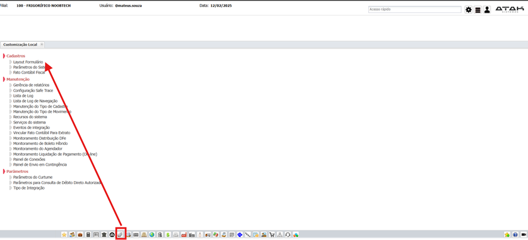
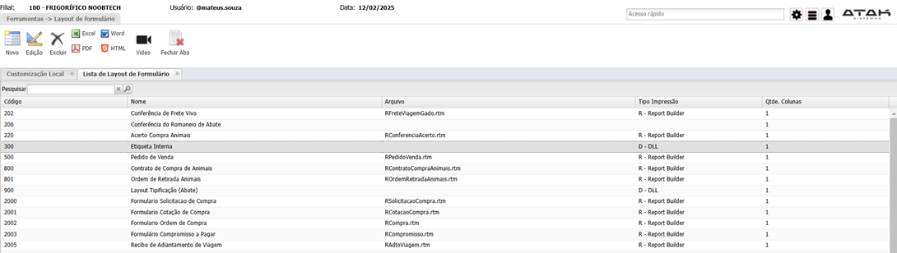
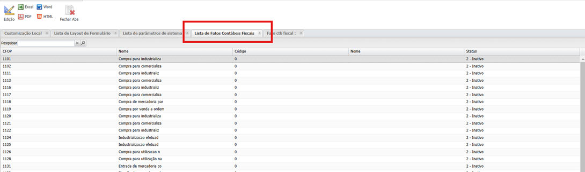
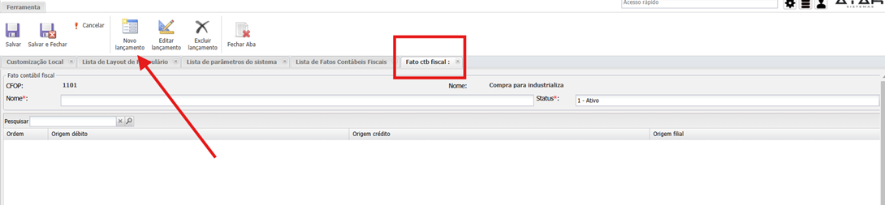
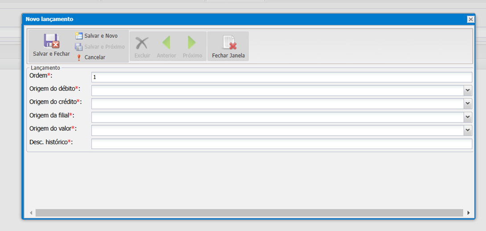

# Customização  
**Rodrigo Amaral**

- **Layout de formulário (relatório):**  
  O layout de formulário já vem da base. Para criação de um novo, caso o padrão não atenda o cliente, é necessário solicitar ao Escritório de Projetos.

- **Fato contábil no ERP:**  
  O fato contábil no ERP é misto. É necessário registrar tanto o débito quanto o crédito.

  
  

